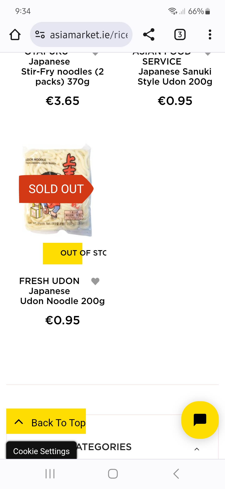
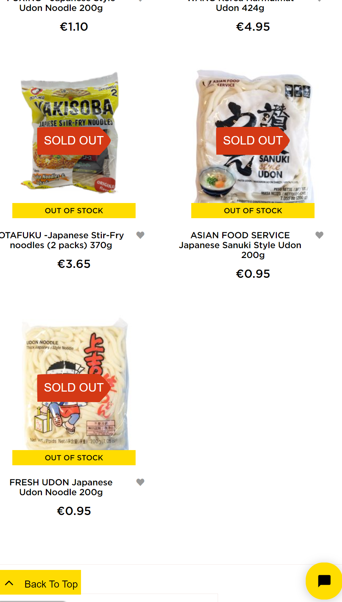

# Asia Market Website Fix

## Issue
On a Samsung Galaxy S23, the text within the "Out of Stock" button overflows its background. Additionally the back to top button dind't have enough padding affecting the overall user experience.

## Analysis
The original CSS set a fixed width of 45% for the "Out of Stock" button. This was insufficient to contain the text on smaller screens, leading to overflow. Furthermore, without a maximum width.

## Solution Implementation
The following CSS changes were made to address the issue:

1. **Responsive Design:** Different styles were applied for smaller and larger screens using media queries.
2. **Auto Width and Padding:** The button width was set to `auto` to adapt to the content, with added padding for better spacing.
3. **Maximum Width:** A maximum width was set to ensure the button does not become too wide on larger screens.
4. **Text Overflow Handling:** Used `white-space: nowrap`, `overflow: hidden`, and `text-overflow: ellipsis` to manage text overflow.

### Updated CSS

```css
/* Styles for screens larger than 767px */
@media (min-width: 768px) {
    .products-grid .item .image-wrapper .button-wrapper .btn.outstock-btn {
        width: auto !important;
        padding: 5px 10px;
        max-width: 200px;
        white-space: nowrap;
        overflow: hidden;
        text-overflow: ellipsis;
        box-sizing: border-box;
    }
}

/* Styles for screens up to 767px */
@media (max-width: 767px) {
    .products-grid .item .image-wrapper .button-wrapper .btn.outstock-btn {
        width: auto !important;
        max-width: 100%;
        padding: 5px 10px;
        white-space: nowrap;
        overflow: hidden;
        text-overflow: ellipsis;
        box-sizing: border-box;
    }
}

body .label {
    color: inherit;
    padding: 5px; /*Change the padding for the back to top button to 5px*/
    margin: 0;
    display: inline-block;
    font-weight: 400;
    position: relative;
    z-index: 0;
    font-size: 20px;
    line-height: normal;
}


```

## Before and After Comparison
Before Fix:
The "Out of Stock" button text overflows its background on smaller screens and the back to top button had little padding on the right.


After Fix:
The button adjusts to the content size without overflowing on smaller screens.
The button maintains a reasonable width on larger screens.

Before Fix Screenshot:



After Fix Screenshot:


### Free Solution Offer
I have identified and implemented a solution to the overflow issue on the "Out of Stock" and "Back to Top" buttons. I am offering this fix completely free of charge to enhance the user experience on your site.

## Contact and Contribution
I contacted the website owners with the following message to offer my solution:

### Email Sent:

Subject: Website Issue and Free Solution for Asia Market

Dear Asia Market Team,

My name is David Diaz, and I am a [Junior Software developer]. While browsing your website, I noticed that the text within the "Out of Stock" and "Back to Top" buttons overflows their backgrounds on a Samsung Galaxy S23.

I have identified the cause of this issue and have implemented a solution that I believe will enhance the user experience on your site. I am offering this solution completely free of charge.

Here is a brief summary of the fix:
- Adjusted the button styles to adapt to the content size.
- Ensured that the buttons do not become too wide on larger screens.

You can find the detailed implementation and code in my GitHub repository: [https://github.com/DavidcD8/asia-market-fix](https://github.com/your-username/asia-market-fix)


Thank you for your time, and I look forward to your response.

Best regards,
David Diaz
[Profile/Portfolio](https://github.com/DavidcD8)


